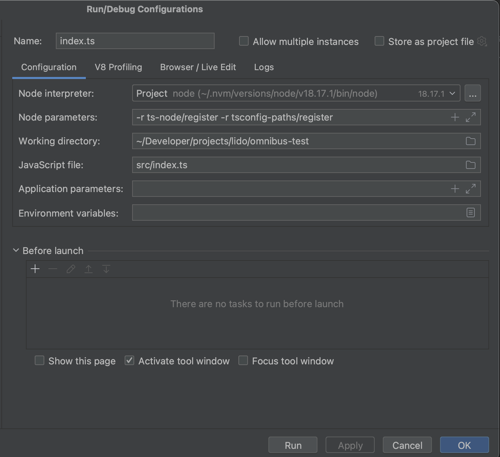

# omnibus-test

1. yarn install
2. cp `.env.goerly-fork.sample` or `.env.mainent-fork.sampleo` to `.env`
3. Provide path envs variables (by default they're ok)
4. from repo root run `make install_anvil`. It compiles anvil locally and but bin files into `third_party` folder.
5. Provide into Makefile your EL RPC url. In current example - infura url. But you can switch to any you want
6. `make run_anvil_mainnet` or `make run_anvil_goerly` for running needed fork network locally
7. For running, debugging code in WebStorm
   * Node parameters: `-r ts-node/register -r tsconfig-paths/register`
   * Working directory `~/Developer/projects/lido/omnibus-test`
   * Java script file `src/index.ts`
   * 
8. For running from console, look at package.json
   * "build": "tsc --build",
   * "start": "node dist/src/index.js",
   * "start:dev": "ts-node src/index.ts",
   * "format": "prettier --write \"src/**/*.ts\" \"test/**/*.ts\"",
   * "lint": "eslint \"{src,apps,libs,test}/**/*.ts\" --fix"

Summary:
* The entry point into app is `src/index.ts::main` 
* The repository is written with the clean code principle illustrated by Robin Martin at `Clean Architecture in Chapter 13